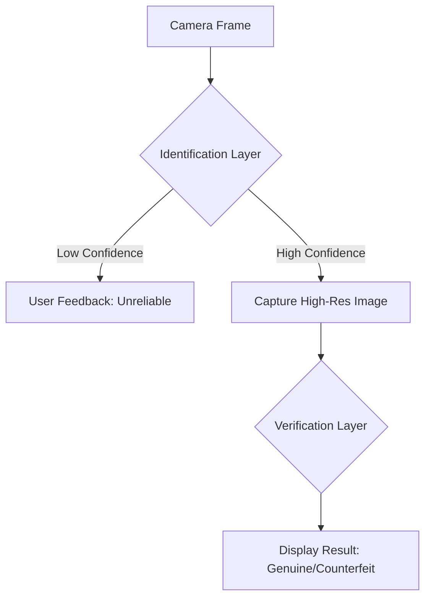

# MoneySense: Identification & Verification Pipeline

This document provides a comprehensive technical overview of the currency identification and authenticity verification process within the MoneySense application.

---

## Table of Contents

1. [High-Level Overview](#high-level-overview)
2. [Phase 1: Real-Time Identification (The YOLO Layer)](#phase-1-real-time-identification-the-yolo-layer)
    - [Frame Acquisition](#frame-acquisition)
    - [Pre-processing & Optimization](#pre-processing--optimization)
    - [TFLite Inference](#tflite-inference)
    - [The Stability Queue](#the-stability-queue)
3. [Phase 2: Transition & Image Capture](#phase-2-transition--image-capture)
4. [Phase 3: Authenticity Verification (The ResNet Layer)](#phase-3-authenticity-verification-the-resnet-layer)
    - [The Expanded Crop Logic](#the-expanded-crop-logic)
    - [Neural Classification](#neural-classification)
5. [Reliability & User Feedback](#reliability--user-feedback)
6. [Performance Architecture](#performance-architecture)

---

## High-Level Overview

MoneySense uses a multi-stage computer vision pipeline to identify and verify Philippine currency. The process flows from a high-speed "Identification" stage (focused on speed and bounding boxes) to a high-precision "Verification" stage (focused on security features).

---

## Phase 1: Real-Time Identification (The YOLO Layer)

### Frame Acquisition
The app listens to a stream of `CameraImage` frames from the camera sensor. On most Android devices, these frames arrive in **YUV_420_888** format at roughly 30 frames per second.

### Pre-processing & Optimization
To achieve "near-zero" latency, we bypass standard Flutter image conversions. Inside a persistent background Isolate:
- **Direct YUV-to-Float conversion**: We loop through the Y, U, and V planes and convert them directly into a normalized `Float32List` (-1.0 to 1.0) expected by the TFLite model.
- **Coordinate Mapping**: The camera sensor operates in Landscape, while the app UI is Portrait. Every bounding box is transformed using a 90-degree CW rotation formula: `(x, y) -> (1-y, x)`.

### TFLite Inference
We utilize a **YOLOv8-Nano** model optimized for TFLite. It outputs:
- **Denomination**: (20, 50, 100, 200, 500, 1000)
- **Type**: (Bill or Coin)
- **Bounding Box**: Precise coordinates of the currency in the frame.
- **Confidence**: 0.0 to 1.0 score.

### The Stability Queue
To prevent "flickering" results, the `ScannerNotifier` uses a stability check. 
- A result must be consistent for `_requiredFrames` (currently set to 1 for maximum speed, but adjustable).
- If the confidence is below **30%**, the result is classified as **Uncertain**.

---

## Phase 2: Transition & Image Capture

Once a bill is identified with high confidence, the app triggers a "Communicate" phase:
1. **High-Res Capture**: We take the *current* frame being processed and convert it into a high-quality JPEG in a background task (`_yuvToJpegTask`).
2. **Result Screen**: The user is moved to the Result Screen where the bill preview is shown in a "Currency Card."

---

## Phase 3: Authenticity Verification (The ResNet Layer)

Verification only occurs for **Bills** and requires the high-resolution image captured in Phase 2.

### The Expanded Crop Logic
Authenticity models are sensitive to context. If we crop *too tightly* to the bill, we might exclude critical security features (like the security thread or holographic patches).
- **25% Buffer**: We expand the bounding box by 25% in all directions before cropping.
- **Boundary Clamping**: We ensure the expanded coordinates stay within the image dimensions (0 to width/height).

### Neural Classification
The cropped bill is fed into a **ResNet-18** classifier. This model is specifically trained on genuine vs. counterfeit features of Philippine BSP bills. 
- **Genuine**: The bill has been verified to have correct textures, colors, and security alignment.
- **Counterfeit**: Significant discrepancies detected.
- **Fail-Safe**: If the identification was marked as "Uncertain," the verification is automatically skipped to prevent misleading results.

---

## Reliability & User Feedback

MoneySense prioritizes **Trust** over speed when they conflict.

- **Low-Confidence Blocking**: If the identification layer isn't sure of the bill (Uncertain), the app will proactively block the verification phase. It tells the user: *"The identification is unreliable. Please hold steady."* This prevents a potentially misidentified bill from being "Verifed" incorrectly.
- **Visual Feedback**: The bounding box rendered on the viewfinder changes color (Green for high confidence, Red for Uncertain).

---

## Performance Architecture

The entire process is built on **Isolates** to ensure the UI never stutters:
1. **Identification Isolate**: A dedicated worker thread that stays alive, avoiding the 100ms "startup" cost of standard `compute()` calls.
2. **JPEG Task Isolate**: A separate task for encoding high-res images to avoid blocking the detection loop.
3. **Inlined Processing**: By doing YUV conversion and Normalization in a single loop, we reduce memory allocations, which is the #1 cause of lag on low-end Android devices.

---
*Document Version: 2.1 (Restored Accuracy Build)*
