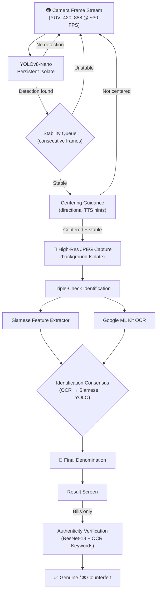

# MoneySense: Identification & Verification Pipeline

A deep-dive technical reference for the currency scanning engine — from raw camera frame to spoken result.

---

## Table of Contents

1. [High-Level Pipeline](#1-high-level-pipeline)
2. [Phase 1: Real-Time Detection (The YOLO Layer)](#2-phase-1-real-time-detection-the-yolo-layer)
   - 2.1 Frame Acquisition
   - 2.2 The Persistent Isolate
   - 2.3 YUV-to-Tensor Pre-processing
   - 2.4 Dynamic Model Adaptation
   - 2.5 TFLite Inference
   - 2.6 Post-processing & NMS
   - 2.7 Coordinate Normalization
   - 2.8 Dynamic ₱20 Discrimination
3. [Phase 2: Stability & Centering](#3-phase-2-stability--centering)
   - 3.1 Stability Queue
   - 3.2 Centering Guidance Engine
   - 3.3 State Machine Transitions
4. [Phase 3: Frame Capture & Image Encoding](#4-phase-3-frame-capture--image-encoding)
5. [Phase 4: Collaborative Identification — The "Triple Check"](#5-phase-4-collaborative-identification--the-triple-check)
   - 5.1 Siamese Feature Extractor
   - 5.2 OCR Cross-Validation
   - 5.3 Consensus Decision Logic
6. [Phase 5: Authenticity Verification (Bills Only)](#6-phase-5-authenticity-verification-bills-only)
   - 6.1 Expanded Crop Logic
   - 6.2 ResNet-18 Physical Classifier
   - 6.3 OCR Security Keyword Veto
   - 6.4 Verification Consensus
7. [Reliability & User Feedback](#7-reliability--user-feedback)
8. [Performance Architecture](#8-performance-architecture)
9. [Scanner State Machine Reference](#9-scanner-state-machine-reference)

---

## 1. High-Level Pipeline

MoneySense uses a multi-stage computer vision pipeline split into two major concerns: **Identification** (what denomination is this?) and **Verification** (is this bill genuine or counterfeit?).



**Key distinction:** The Siamese network is part of the **Identification** pipeline (confirming *which* denomination this is), not the Verification pipeline (which checks genuine vs. counterfeit). This is a deliberate design choice — Siamese embedding similarity tells you "this looks like a ₱500", not "this is a real ₱500".

---

## 2. Phase 1: Real-Time Detection (The YOLO Layer)

*Source: `lib/features/scanner/data/datasources/detection_service.dart`*

### 2.1 Frame Acquisition

The app subscribes to a stream of `CameraImage` frames from the camera sensor via `controller.startImageStream()`. On most Android devices, frames arrive in **YUV_420_888** format at roughly 30 FPS. The stream is bound exactly once per camera session — `_maybeBindImageStream()` uses a `_streamBoundController` reference to prevent duplicate bindings.

### 2.2 The Persistent Isolate

Unlike `compute()`, which spawns and tears down an Isolate per call (~100ms overhead), `DetectionService` uses a **persistent Isolate** that stays alive for the entire app session:

```
Main Isolate                     Detection Isolate
     │                                │
     │ ── _InitCommand ──────────────>│  (loads model, allocates tensors)
     │ <── true ──────────────────────│
     │                                │
     │ ── _InferCommand (YUV data) ──>│  (pre-process + infer + post-process)
     │ <── _InferResult ──────────────│
     │                                │
     │ ── _InferCommand ─────────────>│  (next frame, zero startup cost)
     │ <── _InferResult ──────────────│
     ...
```

The Isolate is spawned via `Isolate.spawn()` and communicates through `SendPort`/`ReceivePort` pairs. The interpreter, model bytes, and all configuration live inside the Isolate's memory space — nothing crosses the boundary except raw YUV byte arrays (in) and detection coordinates (out).

### 2.3 YUV-to-Tensor Pre-processing

To achieve near-zero latency, the Isolate bypasses all standard Flutter/Dart image conversion libraries. Inside a single tight loop:

1. **YUV→RGB conversion** is performed inline using the BT.601 matrix:
   ```
   R = Y + 1.402 × V
   G = Y − 0.344136 × U − 0.714136 × V
   B = Y + 1.772 × U
   ```

2. **Normalization** (divide by 255.0 to get 0.0–1.0) happens in the same loop — no intermediate RGB bitmap is ever allocated.

3. **Bilinear downscale** from camera resolution to model input size is done via stride-based sampling: `srcX = (x * scaleX).toInt()`.

The Y, U, and V planes are accessed by respecting per-plane `bytesPerRow` and `bytesPerPixel` strides, which vary across devices (some pack UV interleaved, others planar).

### 2.4 Dynamic Model Adaptation

The Isolate auto-detects model characteristics at init time:

| Property | Detection Method |
|---|---|
| **Input size** | Read from `inputTensor.shape[1]` (or `shape[2]` if NCHW) |
| **Layout (NHWC vs NCHW)** | If `shape[1] == 3` → NCHW; otherwise NHWC |
| **Quantization** | If `inputTensor.type == TensorType.uint8` → skip normalization, write integers |

This means the same service code works with any YOLOv8 export variant (float32-NHWC, float32-NCHW, or uint8 quantized) without configuration changes.

### 2.5 TFLite Inference

The model is a **YOLOv8-Nano** exported to TFLite with GPU delegate support:

```dart
final options = InterpreterOptions()..threads = 4;
if (Platform.isAndroid) options.addDelegate(GpuDelegateV2());
```

If GPU delegation fails (common on low-end devices), the service falls back to CPU-only inference with 4 threads.

**Model outputs:**
- **Denomination class**: 9 classes (₱1, ₱5, ₱10, ₱20, ₱50, ₱100, ₱200, ₱500, ₱1,000)
- **Type mapping**: Classes 0–2 are coins (₱1, ₱5, ₱10); classes 3–8 are bills
- **Bounding box**: Center-x, center-y, width, height (all in model-pixel or normalized coords)
- **Confidence**: Per-class score (0.0–1.0)

### 2.6 Post-processing & NMS

The output tensor is shaped `[1, rows, cols]` where each column `i` contains `[cx, cy, w, h, class_0_score, class_1_score, ...]`. The service performs a single-pass max-score scan:

```dart
for (int i = 0; i < cols; i++) {
  for (int c = 0; c < numClasses; c++) {
    final score = output[(4 + c) * cols + i];
    if (score > bestScore) { ... }
  }
}
```

Only the single highest-confidence detection is returned per frame. The confidence threshold is **0.50** — anything below is silently dropped.

### 2.7 Coordinate Normalization

YOLO outputs bounding boxes in model-pixel coordinates (e.g., 0–640). These are normalized to 0.0–1.0 by dividing by `inSize`. A safety check handles models that already output normalized coordinates:

```dart
if ((cx > 1.1 || w > 1.1) && inSize > 0) {
  cx /= inSize; cy /= inSize; w /= inSize; h /= inSize;
}
```

All coordinates are clamped to `[0.0, 1.0]` before being returned.

### 2.8 Dynamic ₱20 Discrimination

The ₱20 denomination exists as both a coin and a bill. Since the YOLO model has a single `20` class, the service uses bounding box **aspect ratio** to discriminate at runtime:

```dart
if (denomination == '20') {
  final aspectRatio = w / h;
  type = (aspectRatio > 0.85 && aspectRatio < 1.17) ? 'coin' : 'bill';
}
```

Coins are approximately square (aspect ratio ≈ 1.0); bills are roughly 2.4:1.

### Frame Rate Throttling

A minimum interval of **120ms** between inference calls prevents the detection loop from overwhelming the Isolate. Frames arriving faster are silently dropped:

```dart
if (now - _lastInferMs < _minIntervalMs) return null;
```

---

## 3. Phase 2: Stability & Centering

*Source: `lib/features/scanner/presentation/providers/scanner_provider.dart`*

### 3.1 Stability Queue

The `ScannerNotifier` requires the same denomination to be detected for `_requiredFrames` consecutive frames (currently **1** for maximum responsiveness, but adjustable). Each frame either increments `_consecutiveFrames` if the denomination matches, or resets to 1 if a different denomination appears.

The notifier also tracks the **highest confidence** seen for the current candidate — if frame N+1 has higher confidence than frame N, the candidate is updated while keeping the consecutive count.

### 3.2 Centering Guidance Engine

Once stability is reached, the scanner transitions to `ScannerState.centering`. The centering engine uses the bounding box center `(cx, cy)` and fires directional TTS hints to guide the blind user:

| Bounding Box Center | Guidance Hint |
|---|---|
| `cx < 0.15` | "Move right" |
| `cx > 0.85` | "Move left" |
| `cy < 0.35` | "Move down" |
| `cy > 0.65` | "Move up" |
| Diagonal combinations | "Move right and up", etc. |
| Everything centered | "Centered. Hold steady." |

Guidance is throttled to one hint per **900ms** to avoid overwhelming the user. An earcon plays on the transition to "Centered" state for immediate audio feedback.

**Stability timing:** Once centered, the position must hold stable for **150ms** before the scanner advances to processing. This is deliberately short — the centering phase already validated alignment, so we capture as fast as possible.

**Timeout:** If centering cannot be achieved within **30 seconds**, the scanner resets to scanning state with a failure earcon. If the bill disappears for more than **3 consecutive null frames**, centering also resets.

### 3.3 State Machine Transitions

```
scanning → centering → processing → result
    ↑          │            │
    ←──────────┘            │  (centering lost / timeout)
    ←───────────────────────┘  (reset after result dismissed)
```

---

## 4. Phase 3: Frame Capture & Image Encoding

*Source: `scanner_provider.dart` → `_captureFrame()` and `_yuvToJpegTask()`*

When centering stability is reached, the scanner sets `_pendingFreshCapture = true` and transitions to `processing`. The very next frame that arrives in `processFrame()` is intercepted and cloned (all three YUV planes are deep-copied via `Uint8List.fromList()`).

**JPEG encoding** runs in a separate `compute()` Isolate (not the detection Isolate) via `_yuvToJpegTask()`. This converts the full-resolution YUV420 frame to a JPEG `Uint8List` using the `image` package. This Isolate is short-lived — encoding happens once per scan, so the `compute()` overhead is acceptable.

The JPEG is then passed to the Triple-Check identification pipeline.

---

## 5. Phase 4: Collaborative Identification — The "Triple Check"

*Source: `lib/features/scanner/data/datasources/authenticity_service.dart` → `getCollaborativeIdentification()`*

After YOLO identifies the denomination and a high-res JPEG is captured, the app runs a second-pass identification using two additional models **in parallel** to cross-validate the YOLO result. This is called the "Triple Check" — YOLO, Siamese, and OCR all vote on the denomination.

> **Important:** This phase is about **identification** (which denomination?), not verification (genuine or counterfeit?).

### 5.1 Siamese Feature Extractor

The Siamese network (`moneysense-siamese.tflite`) is a feature extractor that outputs a dense **embedding vector** from the bill image. This embedding is compared against a library of **pre-computed reference embeddings** stored in `reference_embeddings.json`.

**Pre-processing:**
1. The bill is cropped using the YOLO bounding box.
2. The crop is resized to 224×224 with aspect-ratio-preserving letterboxing (centered on a black canvas).
3. Pixels are normalized using ImageNet statistics: `mean=[0.485, 0.456, 0.406]`, `std=[0.229, 0.224, 0.225]`.

**Inference** runs inside a `compute()` Isolate via `_processSiamese()`. The model dynamically adapts to its own input tensor shape (in case the model expects a size different from 224).

**Similarity Matching:** The live embedding is compared against every reference embedding for every denomination using **cosine similarity**:

```
similarity = dot(a, b) / (||a|| × ||b||)
```

The denomination with the highest max-similarity across its reference vectors is the Siamese's vote.

**Multi-vector references:** Each denomination can have multiple reference embeddings (e.g., different bill versions, orientations, or lighting conditions). The best match across all refs is used.

**Coins are skipped** — Siamese verification is only run for bills because no coin reference data exists yet.

### 5.2 OCR Cross-Validation

Google ML Kit's on-device text recognizer is run on the cropped bill image simultaneously with the Siamese model.

**Tagalog denomination dictionary (Gold Standard):**

| Word Found | Denomination |
|---|---|
| `DALAWAMPUNG` | ₱20 |
| `LIMAMPUNG` | ₱50 |
| `SANDAAN` | ₱100 |
| `DALAWANG DAAN` | ₱200 |
| `LIMANG DAAN` | ₱500 |
| `SANG LIBO` / `ISANG LIBO` | ₱1,000 |

If no Tagalog word is found, a numeric cross-check looks for the digit strings `1000`, `500`, `200`, `100`, `50`, `20` (checked in descending order to prevent `100` from matching inside `1000`).

### 5.3 Consensus Decision Logic

The three identification sources are combined with the following priority:

```
Rule 1: OCR text match         → Override denomination (Gold Standard)
Rule 2: Siamese score > 0.94  → Override denomination (Siamese Veto)
Rule 3: Siamese confirms YOLO → Keep YOLO (score > 0.85 + same denom)
         (Siamese + YOLO agree)
Rule 4: Siamese score > 0.90  → Override denomination (Siamese Correction)
         (Siamese disagrees with YOLO but is confident)
Rule 5: Weak consensus        → Keep YOLO result as fallback
```

This layered approach means well-printed bills (clear text) are handled fast by OCR alone, while worn or degraded bills still benefit from neural feature matching.

---

## 6. Phase 5: Authenticity Verification (Bills Only)

*Source: `authenticity_service.dart` → `verify()`*

Verification only occurs for **bills** and runs **after** the result screen is displayed. It requires the high-resolution JPEG captured in Phase 3. The result screen shows the denomination immediately while verification runs in the background, then updates the UI when complete.

### 6.1 Expanded Crop Logic

Authenticity models are sensitive to context. Cropping too tightly excludes security features (threads, holographic patches, microprinting). The bounding box is expanded by **25% in all directions** before cropping, with coordinates clamped to image boundaries.

### 6.2 ResNet-18 Physical Classifier

The cropped bill is processed in a `compute()` Isolate via `_processAndPredict()`:

1. **Letterbox resize** to 224×224 (same as Siamese).
2. **ImageNet normalization**.
3. **TFLite inference** through the `moneysense-verifier-resnet18.tflite` model.
4. **Softmax** over 12 output logits → 6 denominations × 2 classes (genuine/counterfeit).
5. The highest-probability label determines the verdict.

### 6.3 OCR Security Keyword Veto

The same OCR pass checks for security alert keywords that indicate counterfeit or toy money:

```
PLAY MONEY, SPECIMEN, SAMPOL, NOT FOR CIRCULATION,
TOY MONEY, VALUABLE ONLY AS A TOY, REPLICA, NO VALUE,
FAKE, IMITATION, TRAINING ONLY
```

Fragment detection is also applied — if a keyword is ≥6 characters long, its first 5 characters are checked as a prefix match. **If any alert keyword is found, the bill is immediately marked counterfeit regardless of ResNet output** (OCR has veto power).

### 6.4 Verification Consensus

```
Priority 1: OCR Security Alert keyword found → Counterfeit (hard veto)
Priority 2: ResNet classification result     → Genuine or Counterfeit (default)
```

The `VerificationResult` includes diagnostic data for the result screen:
- `classifierScore` — ResNet confidence
- `ocrAlerts` — list of detected security keywords
- `collaborativeDenom` — OCR-confirmed denomination (if found)

---

## 7. Reliability & User Feedback

MoneySense prioritizes **trust** over speed when they conflict.

**Low-Confidence Blocking:** If the YOLO identification layer returns confidence below 30%, the result is classified as `Uncertain`. Uncertain results block both the identification and verification pipelines entirely. The user hears: *"The identification is unreliable. Please hold steady."*

**Visual Feedback:** The `CameraViewfinder` border changes color to reflect the current scanner state:

| State | Color | Animation | Meaning |
|---|---|---|---|
| `idle` / `previewing` | Grey | None | Camera on, waiting |
| `scanning` | Yellow | Pulsing | Actively looking for currency |
| `centering` | Blue | Pulsing + spinner | Bill found, aligning |
| `processing` | Green | Pulsing + spinner | Capturing & identifying |
| `result` | Green | Solid | Detection complete |

**Auto-Flash:** On camera open, the scanner samples ~400 pixels from the Y plane of the first 5 frames. If average luminance falls below 40 (very dark), the flashlight is automatically enabled with TTS confirmation.

---

## 8. Performance Architecture

The entire detection pipeline is built on **Isolates** to keep the UI at 60 FPS:

| Component | Isolate Type | Lifetime | Purpose |
|---|---|---|---|
| YOLOv8 inference | Persistent (`Isolate.spawn`) | App session | Avoids 100ms startup cost; keeps interpreter in memory |
| JPEG encoding | One-shot (`compute()`) | Per capture | Runs once per scan; overhead is acceptable |
| Siamese inference | One-shot (`compute()`) | Per identification | Runs once using `_processSiamese` |
| ResNet-18 inference | One-shot (`compute()`) | Per verification | Runs once using `_processAndPredict` |
| OCR pass | Main isolate (ML Kit) | Per capture | Google ML Kit manages its own threading |

**Inlined processing** is the key optimization: by performing YUV→RGB conversion, normalization, and downscaling in a single tight loop, we eliminate intermediate memory allocations — the #1 cause of frame drops and GC pauses on low-end Android devices.

**Frame throttling** at 120ms minimum interval ensures the detection Isolate is never overwhelmed, and frames arriving while inference is in progress are silently dropped via the `isProcessing` guard.

---

## 9. Scanner State Machine Reference

```
                ┌─────────────────┐
                │      idle       │  Camera closed
                └────────┬────────┘
                         │ openCamera()
                         ▼
                ┌─────────────────┐
           ┌───>│    scanning     │  Actively processing frames
           │    └────────┬────────┘
           │             │ _requiredFrames consecutive match
           │             ▼
           │    ┌─────────────────┐
  timeout/ │    │   centering     │  Guiding user to align bill
  lost bill│    └────────┬────────┘
           │             │ centered + 150ms stability
           │             ▼
           │    ┌─────────────────┐
           │    │   processing    │  Capturing JPEG + Triple-Check
           │    └────────┬────────┘
           │             │ identification complete
           │             ▼
           │    ┌─────────────────┐
           │    │     result      │  → ResultScreen widget takes over
           │    └────────┬────────┘
           │             │ reset() / auto-go-back timer
           └─────────────┘

  Any state ──── pausePreview() ──── ▶ paused
  paused   ──── resumePreview() ─── ▶ scanning
  Any state ──── suspendScanner() ── ▶ paused (route/lifecycle)
  paused   ──── restoreScanner() ── ▶ (previous state or scanning)
```

---

*This document reflects the current production codebase. For architecture rationale and design decisions, see [ARCHITECTURE.md](./ARCHITECTURE.md). For file-by-file reference, see [CODEBASE.md](./CODEBASE.md).*
