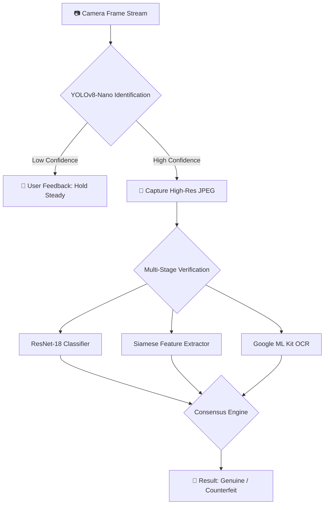

# MoneySense — System Documentation

---

## Table of Contents

1. [System Overview](#1-system-overview)
2. [Supported Currency](#2-supported-currency)
3. [Architecture Overview](#3-architecture-overview)
4. [Feature: Currency Scanner](#4-feature-currency-scanner)
   - 4.1 Real-Time Identification (YOLO Layer)
   - 4.2 Authenticity Verification (Multi-Stage Pipeline)
   - 4.3 Camera Lifecycle Management
   - 4.4 Camera Viewfinder UI
5. [Feature: Accessibility System](#5-feature-accessibility-system)
   - 5.1 Vision Profile & VisionConfig
   - 5.2 Text-to-Speech Engine
   - 5.3 Haptic & Vibration Feedback
   - 5.4 Earcon Audio Cues
   - 5.5 Font Scaling
   - 5.6 TalkBack Compatibility
6. [Feature: Navigation System](#6-feature-navigation-system)
   - 6.1 Gestural Navigation (Swipe)
   - 6.2 Inertial Navigation (Tilt)
   - 6.3 Shake-to-Go-Back
   - 6.4 Voice Commands ("Hey MoneySense")
   - 6.5 Auto Go-Back Timer
7. [Feature: Settings & Personalization](#7-feature-settings--personalization)
   - 7.1 AppSettings Object
   - 7.2 Settings Persistence
   - 7.3 Bilingual Support
   - 7.4 Onboarding Flow
8. [Feature: Interactive Tutorials](#8-feature-interactive-tutorials)
9. [Tech Stack Reference](#9-tech-stack-reference)
10. [Naming Conventions](#10-naming-conventions)

---

## 1. System Overview

MoneySense is a **free, offline, bilingual currency identifier** designed specifically for **visually impaired Filipinos**. It uses the phone's rear (or front) camera to detect Philippine Peso bills and coins in real time, then announces the denomination by voice in **Filipino (Tagalog) or English** — entirely without any internet connection.

### The Problem It Solves

In the Philippines, cash remains the dominant payment method for everyday transactions. For the estimated **2.5 million visually impaired Filipinos**, accurately identifying currency is a persistent daily challenge. The Bangko Sentral ng Pilipinas (BSP) introduced tactile marks on banknotes in 2020, but these are insufficient when notes are worn, folded, or when the user has limited tactile sensitivity. Peso coins are similarly difficult to tell apart by touch alone.

Existing mobile apps that address this problem share common limitations: most only scan one bill at a time, require an internet connection, offer no Filipino-language audio, and are not designed specifically for the Filipino context. MoneySense was built to fill that gap.

### Key Design Goals

| Goal | Implementation |
|---|---|
| Work completely offline | On-device TFLite ML models, no API calls |
| Bilingual voice output | Full Filipino (Tagalog) and English TTS |
| Support all vision levels | 3-tier Vision Profile system |
| Multiple navigation modes | Touch, swipe, tilt, shake, and voice |
| Free to use | Open source, distributed via GitHub Releases |

### Three User Groups

MoneySense is designed for three distinct user profiles, with each profile unlocking different default settings and UI behaviors:

- **Low Vision** — Users who still have usable vision; benefits from larger text and higher-contrast colors. TTS is minimal (scan results only).
- **Partially Blind** — Users who rely on audio cues alongside some remaining vision. TTS announces results and navigation events. Contrast is elevated.
- **Fully Blind** — Users who navigate entirely by sound and touch. TTS announces everything including idle state. Vibration patterns are the primary result output. Contrast is maximum.

---

## 2. Supported Currency

**Philippine Peso Bills:**

| Denomination | Color Code |
|---|---|
| ₱20 | Orange |
| ₱50 | Red |
| ₱100 | Blue-violet |
| ₱200 | Green |
| ₱500 | Yellow |
| ₱1,000 | Blue |

**Philippine Peso Coins:**

New ₱20, New & Old ₱10, New & Old ₱5, New & Old ₱1, New 25 Centavos

---

## 3. Architecture Overview

MoneySense follows **feature-first Clean Architecture** with **Riverpod** for reactive state management.

```
lib/
├── main.dart         App entry point (pre-flight setup & DI bootstrap)
├── app/              Root widget, navigation shell, route constants
├── core/             Shared constants, theme, l10n, and platform services
├── features/         Self-contained feature slices
│   ├── onboarding/   First-launch flow
│   ├── scanner/      Camera + ML pipeline + result display
│   ├── settings/     Preferences, vision profiles, persistence
│   └── tutorial/     Interactive feature walkthroughs
└── shared/           Reusable UI widgets used across ≥2 features
```

### Why Feature-First?

Each feature in MoneySense interacts with different hardware: the scanner uses the camera, navigation features use the accelerometer, and settings use persistent storage. Keeping each feature self-contained means the camera code, camera state, and camera UI are all in the same place. Adding or removing a feature is a folder operation, not a search-and-edit across the project.

Each feature folder contains three internal layers:

```
features/<name>/
├── data/         Platform & storage access (camera, SharedPreferences)
├── domain/       Pure Dart entities & enums (no Flutter imports, fully testable)
└── presentation/ Riverpod providers (state logic) + screens + widgets
```

> [!IMPORTANT]
> The **domain layer** has zero Flutter or third-party imports. This means all business logic can be unit-tested without a device or emulator.

### Why Riverpod?

Riverpod was chosen over BLoC and the standard `Provider` package for four specific reasons relevant to this app:

1. **Cross-widget state without manual wiring** — `cameraOpenProvider` and `appSettingsProvider` are consumed simultaneously by the scanner, the bottom nav, the shake detector, and the settings screen. Riverpod makes this trivial.
2. **Hardware lifecycle management** — `ref.onDispose` automatically stops accelerometer streams and disposes camera controllers when providers are garbage-collected, preventing resource leaks.
3. **Async hardware initialization** — Camera initialization is async and can fail. `AsyncNotifierProvider` gives `AsyncValue<CameraController?>` for free — covering loading, error, and data states without boilerplate.
4. **Selective rebuilds** — A widget that only cares about one setting uses `.select()` to avoid rebuilding when unrelated settings change. For example: `appSettingsProvider.select((s) => s.shakeToGoBack)`.

---

## 4. Feature: Currency Scanner

The scanner is the core feature of MoneySense. It is implemented as a multi-stage computer vision pipeline: a fast **Identification** stage followed by a high-precision **Verification** stage.



### 4.1 Real-Time Identification (YOLO Layer)

**Frame Acquisition:** The app subscribes to a stream of `CameraImage` frames from the camera sensor. On most Android devices, these arrive in `YUV_420_888` format at ~30 FPS.

**Pre-processing — Near Zero Latency:** To achieve near-zero latency, the app bypasses standard Flutter image conversion inside a **persistent background Dart Isolate**:

- **Direct YUV-to-Float**: Y, U, and V planes are looped directly into a normalized `Float32List` (range: -1.0 to 1.0) expected by the TFLite model. This avoids intermediate bitmap allocations, which are the primary cause of lag on low-end Android devices.
- **Portrait Coordinate Mapping**: The camera sensor operates in Landscape orientation while the app UI is Portrait. Every bounding box is transformed using a 90° CW rotation formula: `(x, y) → (1-y, x)`.

**TFLite Inference:** A **YOLOv8-Nano** model optimized for TFLite runs on-device. It outputs:
- **Denomination**: ₱20, ₱50, ₱100, ₱200, ₱500, ₱1,000
- **Type**: Bill or Coin
- **Bounding Box**: Normalized coordinates (left, top, width, height)
- **Confidence**: 0.0–1.0 score

**Stability Queue:** To prevent flickering results, the `ScannerNotifier` runs a stability check. Results below **30% confidence** are classified as `Uncertain` and block the verification pipeline from producing a misleading result. The `_requiredFrames` count ensures the same denomination is seen consistently before proceeding.

**Performance Architecture — Isolates:**

| Isolate | Purpose |
|---|---|
| Identification Isolate | Stays alive across frames; avoids 100ms startup cost of `compute()` |
| JPEG Task Isolate | Encodes high-res images in background to avoid blocking detection |

### 4.2 Authenticity Verification (Multi-Stage Pipeline)

Once a bill is identified with high confidence, the app captures a high-resolution JPEG and runs three verifiers in parallel:

#### Stage 1: ResNet-18 Physical Classifier

- The cropped bill image is resized to 224×224 and normalized using ImageNet statistics (`mean=[0.485, 0.456, 0.406]`, `std=[0.229, 0.224, 0.225]`).
- The **ResNet-18** TFLite model outputs 12 logits — one for each `genuine_<denom>` / `counterfeit_<denom>` class.
- Softmax is applied and the highest probability label is selected.
- A 25% bounding box expansion ensures security features (threads, holographic patches) are included in the crop.

#### Stage 2: Siamese Feature Extractor

- A second neural network (Siamese model) extracts a **feature embedding vector** from the bill image.
- This embedding is compared against a library of **pre-computed reference embeddings** for each denomination loaded from `reference_embeddings.json`.
- Similarity is measured using **cosine similarity**: `dot(a, b) / (||a|| * ||b||)`.
- **Decision rules:**
  - `score > 0.94` → Siamese overrides (vetoes) YOLO's denomination classification.
  - `score > 0.85` + agreement with YOLO → Confirms YOLO result.
  - `score > 0.90` + disagreement with YOLO → Siamese correction is applied.

#### Stage 3: Google ML Kit OCR

- The bill crop is fed into Google ML Kit's on-device text recognizer.
- **Tagalog denomination words** are matched first (Gold Standard dictionary: `DALAWAMPUNG`, `LIMAMPUNG`, `SANDAAN`, etc.).
- **Numeric values** are cross-checked if no Tagalog word is found.
- **Security alert keywords** act as a hard veto: if `PLAY MONEY`, `SPECIMEN`, `SAMPOL`, `NOT FOR CIRCULATION`, `REPLICA`, or similar text is found, the bill is immediately marked as counterfeit regardless of classifier output.

#### Consensus Engine

The three verifiers feed into a consensus decision:

```
Priority 1: OCR Security Alert Keyword → Counterfeit (veto power)
Priority 2: OCR Denomination Text      → Denomination override (gold standard)
Priority 3: Siamese Score ≥ 0.94      → Denomination override (veto power)
Priority 4: Siamese + YOLO agreement  → Confirmed genuine
Priority 5: YOLO result alone         → Default fallback
```

This layered approach means that easy bills (clearly printed text) are handled fast by OCR alone, while worn or visually degraded bills still benefit from neural feature matching.

### 4.3 Camera Lifecycle Management

The camera lifecycle is the most complex part of the app, involving Android lifecycle events, route changes, the flash state, and intent flags all interacting together.

**Intent vs. Hardware State (Two-Provider Pattern):**

```
cameraOpenProvider       → What the user WANTS (bool intent flag)
cameraControllerProvider → What the hardware IS DOING (CameraController?)
```

This separation exists because the user's intent must **survive** background/foreground cycles while the hardware controller must be **released** whenever the app loses foreground. `suspendCamera()` releases the hardware but leaves the intent flag `true`. `closeCamera()` clears the intent. On resume, the app checks the intent flag to decide whether to reopen.

**Why `AppLifecycleState.inactive` is Ignored:**

`inactive` fires when the user pulls down the notification shade or when a call HUD appears — not genuine backgrounds. Releasing the camera on `inactive` would accidentally turn off the flashlight every time the user pulls down the notification bar while scanning. Hardware is only released on `paused` or `hidden`.

**Route Awareness (`_routeObscured` flag):**

`ScannerScreen` subscribes to a shared `RouteObserver` via the `RouteAware` mixin:
- `didPushNext()` fires when Settings/Tutorial is pushed on top → camera suspends.
- `didPopNext()` fires when that route pops → camera resumes if intent is still true.

A boolean `_routeObscured` flag prevents double-resume when the user backgrounds the app while Settings is open and then returns.

### 4.4 Camera Viewfinder UI

The `CameraViewfinder` widget draws an animated border around the camera preview whose color and behavior reflects the current `ScannerState`:

| Scanner State | Border Color | Animation |
|---|---|---|
| `idle` / `previewing` | Subtle grey | None |
| `scanning` | Yellow (accent) | Pulsing (800ms loop) |
| `centering` | Blue (accent) | Pulsing + spinner |
| `processing` | Green (success) | Pulsing + spinner |
| `result` | Green (success) | Solid |

A **target reticle** (white rectangular outline) overlays the viewfinder during `scanning` and `centering` states to guide the user to align the bill in the center of the frame. A glow effect matching the border color appears during all active states using `BoxShadow`.

> [!NOTE]
> The border is drawn **outside** the content using a wrapping container, ensuring it is never clipped by the screen edge regardless of device size.

---

## 5. Feature: Accessibility System

Accessibility is not an add-on in MoneySense — it is the foundational design layer that every other feature is built on top of.

### 5.1 Vision Profile & VisionConfig

The **Vision Profile** is the primary personalization mechanism. During onboarding, the user selects one of three profiles. This drives the `VisionConfig` object, which is the **single source of truth** for how a profile changes the app.

```
VisionProfile → VisionConfig → All UI widgets & services
```

`VisionConfig` computes and exposes:

| Property | Low Vision | Partially Blind | Fully Blind |
|---|---|---|---|
| `fontScaleFloor` | 1.0x | 1.3x | 1.6x |
| `contrastLevel` | `normal` | `elevated` | `maximum` |
| `defaultTtsVerbosity` | `minimal` | `standard` | `full` |
| `defaultHapticIntensity` | `subtle` | `medium` | `strong` |
| `autoAnnounceResults` | ✗ | ✓ | ✓ |
| `announceNavigation` | ✗ | ✓ | ✓ |
| `announceIdleState` | ✗ | ✗ | ✓ |
| `preferAudioPrimary` | ✗ | ✓ | ✓ |

**Why `VisionConfig` instead of direct profile switches?**

If widgets read from `VisionProfile` directly with a `switch` statement, every widget would need to be updated when a profile is added or modified. With `VisionConfig` as the intermediary, a widget only asks *"what color should I use?"* — not *"which profile is active?"*. Changing a contrast threshold in `VisionConfig` propagates to every screen automatically.

**Contrast-Adaptive Color System:**

Every widget reads accent colors from `VisionConfig.accent(isDark)` rather than from `AppColors` directly:

- `normal` — Standard palette (existing AppColors)
- `elevated` — Slightly stronger text/border contrast for partial blindness
- `maximum` — Maximum contrast: pure white text, stronger borders, boosted accent brightness

The design rule is: **yellow** on dark surfaces, **blue** on light surfaces. This is enforced universally via `accent(isDark)`.

### 5.2 Text-to-Speech Engine

The `TtsService` is a priority-queued TTS engine that ensures critical messages are never blocked by lower-priority ones.

**Priority Levels (lowest to highest):**

| Priority | Used For |
|---|---|
| `ambient` | Idle scanner hints ("Hold phone over currency") |
| `navigation` | Screen transition announcements |
| `result` | Denomination and authenticity results |
| `critical` | Error states and permission alerts |

**Key behaviors:**
- A scan result (`result` priority) always interrupts an ongoing ambient utterance.
- Navigation messages are **debounced** so rapid transitions produce one utterance instead of stacking.
- When TalkBack is detected as active, the engine adds a short delay so MoneySense's voice does not talk over TalkBack's announcements.
- Language (English/Tagalog) can be switched at runtime without restarting the engine.

All TTS messages are constructed by `speech_scripts.dart` and `scanner_speech_scripts.dart` using strongly-typed `TtsMessage` objects rather than raw strings. This means every spoken utterance is auditable and localized in one place.

### 5.3 Haptic & Vibration Feedback

The `HapticService` controls all vibration feedback with three intensity levels:

| Intensity | Behavior |
|---|---|
| `subtle` | Flutter's built-in `HapticFeedback` only (no motor vibration) |
| `medium` | `HapticFeedback` + single short motor pulse |
| `strong` | Full motor vibration with denomination-specific patterns |

**Denomination Vibration Patterns:**

For fully blind users, denomination patterns are a **primary output channel**, not a secondary confirmation. Each of the 10 denominations has a unique pattern of long and short pulses:

- **Coins**: One long pulse followed by N short pulses (where N corresponds to the coin rank).
- **Bills**: N short pulses (where N corresponds to the bill rank — ₱20 = 1 pulse, ₱50 = 2, ₱100 = 3, ₱200 = 4, ₱500 = 5, ₱1,000 = 6).

Device vibration capabilities are **cached at startup** so patterns fire immediately without any async delay.

> [!TIP]
> The interactive Denomination Vibration Tutorial lets users practice each pattern before relying on it in real use. This is crucial for fully blind users who must learn the patterns by feel.

### 5.4 Earcon Audio Cues

The `EarconService` plays non-speech audio cues (earcons) for app events — for example, a sound when scanning starts, a distinct sound when a result is ready, and a sound when a button is pressed. Earcons are independent of TTS and provide a low-latency audio channel that complements voice announcements. They can be toggled independently in settings (`earconEnabled`).

### 5.5 Font Scaling

The user's chosen font scale (range: 0.8x to 2.0x) is applied at the root of the widget tree via a `MediaQuery` override in `app.dart`. All text in the app scales without any individual widget needing to know about it.

The one exception: **segmented selector pills** (used for Theme and Language settings) opt out of scaling with `MediaQuery.withNoTextScaling` because they are fixed-size chrome and cannot grow without breaking the layout.

Each vision profile enforces a **font scale floor** from `VisionConfig.effectiveFontScale(userScale)`. This means a fully blind user cannot accidentally reduce text below 1.6x their base scale even if the slider is moved low.

### 5.6 TalkBack Compatibility

Every interactive widget manages its own semantics tree explicitly. Flutter's automatic merging can combine a tile and its help button into a single TalkBack focus node, which would hide the help button from screen reader users.

The approach used throughout MoneySense:
- Composite tiles use `excludeSemantics: true` on the top-level `Semantics` node to suppress descendant auto-generated nodes.
- Explicit child `Semantics` nodes are created for the parts TalkBack needs to reach.
- When a tile and a help button must be separate focus stops, both use `container: true` to create hard boundaries.

---

## 6. Feature: Navigation System

MoneySense provides four parallel navigation modes that can be independently enabled. Users who are fully blind do not need to learn swipe gestures — they can use tilt or voice commands instead. All modes coexist without conflict.

### 6.1 Gestural Navigation (Swipe)

When `gesturalNavigation` is enabled, the scanner screen detects horizontal swipe gestures:

| Gesture | Destination | Slide Animation |
|---|---|---|
| Swipe right | Settings | Enters from the left |
| Swipe left | Tutorial hub | Enters from the right |

The slide direction always matches the gesture direction so users can build a spatial mental model of where each screen lives.

**Why `Navigator.push()` instead of tab switching?**

When Settings or Tutorial is open, the bottom nav disappears. Using `Navigator.push()` achieves this automatically — no custom visibility logic needed. Android's native back button behavior is also handled for free.

### 6.2 Inertial Navigation (Tilt)

`InertialService` detects phone tilt using the raw accelerometer (not the gyroscope). It implements several safeguards to prevent accidental navigation:

| Safeguard | Threshold |
|---|---|
| **Flat-phone guard** | `|z| > 8.0 m/s²` rejects navigation when lying on a surface |
| **Dominance margin** | X-axis must exceed Y-axis by `5.0 m/s²` to count as landscape |
| **Hold duration** | Landscape must be held for **1 second** before the callback fires |
| **Cooldown** | **1.5 second** minimum gap between consecutive fires |

The `InertialDetectorWidget` uses `RouteAware` to pause tilt navigation when another screen is on top and resume it when the user returns to the scanner.

### 6.3 Shake-to-Go-Back

`ShakeService` detects intentional phone shakes using the accelerometer. It filters out walking and incidental motion by requiring:
- A high acceleration threshold
- **Two confirmed jolts** within a short time window

Thresholds are tuned so normal phone handling (including walking) never triggers navigation. The `ShakeDetectorWidget` pauses the accelerometer sensor when the app is backgrounded to conserve battery.

### 6.4 Voice Commands ("Hey MoneySense")

The voice command system provides fully hands-free control, activated by a toggle in Settings or configured during Onboarding. It operates globally — meaning it works from any screen.

**Two-Phase Wake-Word Detection:**

1. **Passive Listening**: The engine continuously listens for the "hey moneysense" trigger phrase.
2. **Active Command Parsing**: Once triggered, the engine enters active listening state, displayed via `VoiceCommandOverlay`. The user's utterance is captured and processed.

**Three-Stage Processing Pipeline:**

```
Raw Audio
  → VoiceCommandService (STT via speech_to_text)
  → VoiceIntentParser (regex + fuzzy matching, bilingual)
  → VoiceCommandExecutor (dispatches action via Riverpod providers)
```

**Supported Intent Actions (via `VoiceIntent` enum):**

| Intent | Example Commands |
|---|---|
| `openSettings` | "go to settings", "buksan ang settings" |
| `openTutorial` | "open tutorial", "tutorial" |
| `toggleFlash` | "turn on flash", "i-on ang flash" |
| `scanNow` | "scan now", "mag-scan" |
| `goBack` | "go back", "bumalik" |
| `stopScanning` | "stop", "tigilan" |

Both English and Tagalog commands are supported through regex matching and flexible phrasing in `VoiceIntentParser`. The system is **non-blocking** — voice navigation coexists with touch, gestural, and inertial navigation simultaneously.

### 6.5 Auto Go-Back Timer

After a scan result is displayed, the `ResultScreen` can automatically return the user to the scanner after a configurable timer (default: 20 seconds). This prevents a fully blind user from getting "stuck" on the result screen.

The timer is implemented as a `MsTimerTile` setting — the toggle and duration badge are separate TalkBack focus nodes so both are independently accessible.

---

## 7. Feature: Settings & Personalization

### 7.1 AppSettings Object

All **18 user preferences** live in one immutable `AppSettings` value object under `appSettingsProvider`. This includes:

**General:**
- `themeMode` — System / Light / Dark
- `language` — English / Tagalog
- `fontScale` — 0.8×–2.0×

**Scanning:**
- `useFrontCamera` — Front or rear camera
- `useFlashlight` — Flashlight toggle
- `denominationVibration` — Vibration patterns on result

**Navigation:**
- `shakeToGoBack` — Shake gesture
- `goBackTimerSeconds` — Auto-return timer (0 = off)
- `gesturalNavigation` — Swipe gestures
- `inertialNavigation` — Tilt gestures
- `voiceNavigation` — "Hey MoneySense" wake word

**Accessibility:**
- `visionProfile` — Low Vision / Partially Blind / Fully Blind
- `ttsEnabled` — TTS on/off
- `ttsVerbosity` — Minimal / Standard / Full
- `speechRate` — TTS speed (1.0 default)
- `hapticFeedback` — Haptic on/off
- `hapticIntensity` — Subtle / Medium / Strong
- `earconEnabled` — Audio cues on/off

> [!NOTE]
> Using one value object means one subscription (not 18), atomic updates via `copyWith`, and a single serialization call to persist everything. Widgets that only care about one field use `.select()` to limit rebuilds.

All state mutations go through **named mutator methods** in `AppSettingsNotifier` (e.g., `setThemeMode`, `setVisionProfile`). No widget ever writes `state = ...` directly. This keeps all state transitions named, auditable, and easy to trace.

### 7.2 Settings Persistence

`SettingsStorage` reads and writes `AppSettings` to `SharedPreferences` using string key constants (no magic strings, no typos). Each field is stored individually so partial settings can be recovered even if a field is newly added in an update.

On app startup, `SharedPreferences` is initialized in `main()` **before** `runApp()` is called, then injected via `ProviderScope.overrides`. This means the entire app starts with real user preferences already in place — no loading flash on the first frame.

### 7.3 Bilingual Support

All user-facing strings live in `en.dart` and `tl.dart`. `AppLocalizations.of(isTagalog)` returns the correct string table without needing a `BuildContext`, which means strings work in providers, services, and TTS scripts without passing context through call chains.

### 7.4 Onboarding Flow

A 6-page `PageView` shown on first launch walks users through:

| Page | Content |
|---|---|
| Welcome | App introduction and core value proposition |
| Vision Profile | Pick Low Vision / Partially Blind / Fully Blind |
| Language | English or Tagalog |
| Navigation Mode | Standard, Gestural, Inertial, or Voice |
| Camera Permission | Grants camera access |
| Ready | Choose "Show me around" (app tour) or "Start scanning" |

All choices are held in **local `StatefulWidget` state** until the final page, where they are written to `AppSettings` in a single atomic update. This prevents partial settings from being saved if the user quits mid-onboarding.

Accent colors update **live** as the vision profile is selected during onboarding so the user immediately sees the contrast boost that applies to their profile.

---

## 8. Feature: Interactive Tutorials

The tutorial system provides a guided walkthrough of every significant app feature, accessible at any time from the bottom navigation bar.

### Tutorial Hub

`TutorialScreen` shows a card for each available tutorial grouped by feature area. Adding a new tutorial requires exactly three changes: add a value to `TutorialRoute`, add a case in `TutorialNavigator`, add a card in `TutorialScreen`. All layout, animation, and back gesture behavior is handled by `MsTutorialScaffold`.

### Tutorial Scaffold

`MsTutorialScaffold` provides a standardized layout for all tutorials:
- A **260px hero zone** at the top for an animated illustration.
- A **scrollable content area** below with a badge, title, description, and numbered steps.
- An optional **interactive zone** at the bottom for live gesture/sensor practice.

### Available Tutorials

| Tutorial | Feature | Interactive? |
|---|---|---|
| App Navigation | Bottom nav, swipe, tilt, shake | ✓ Live sensor input |
| Denomination Vibration | All 10 peso denominations | ✓ Tap to feel pattern |
| Shake to Go Back | Shake gesture | ✓ Live accelerometer |
| Gestural Navigation | Swipe left/right | ✓ Live gesture pad |
| Inertial Navigation | Phone tilt | ✓ Live tilt feedback |

The **App Navigation Tutorial** is automatically launched if the user chooses "Show me around" at the end of onboarding.

The **Denomination Vibration Tutorial** lets users practice all 10 peso patterns or play them in sequence. Coins use a long pulse + short pulses; bills use only short pulses with the count matching denomination rank.

---

## 9. Tech Stack Reference

| Tool | Version | Purpose |
|---|---|---|
| Flutter | 3.x (stable) | Cross-platform UI framework |
| Dart | 3.x | Language |
| flutter_riverpod | ^2.6.1 | Reactive state management |
| camera | ^0.11.1 | Camera hardware access & lifecycle |
| flutter_tts | ^4.2.3 | Text-to-speech output |
| sensors_plus | ^6.1.1 | Accelerometer (shake & tilt detection) |
| vibration | ^2.0.0 | Custom amplitude & pattern motor vibration |
| shared_preferences | ^2.5.3 | Persistent key-value settings storage |
| flutter_secure_storage | ^9.2.4 | Secure credential storage |
| speech_to_text | ^7.3.0 | Voice command recognition (STT) |
| tflite_flutter | ^0.12.1 | On-device TFLite model inference |
| google_mlkit_text_recognition | ^0.12.0 | On-device OCR (bill text reading) |
| image | ^4.2.0 | Image decoding, cropping, resizing |
| go_router | ^14.8.1 | Named route constants (deep-link ready) |
| intl + flutter_localizations | ^0.20.1 | Internationalisation support |
| qr_flutter | ^4.1.0 | QR code generation for app sharing |
| url_launcher | ^6.3.2 | Open URLs externally |
| audioplayers | ^6.6.0 | Earcon audio cue playback |
| gap | ^3.0.1 | Declarative spacing widget |
| **YOLOv8-Nano** | TFLite | Real-time bill & coin identification |
| **ResNet-18** | TFLite | Genuine vs counterfeit classification |
| **Siamese Network** | TFLite | Feature embedding for denomination verification |

---

## 10. Naming Conventions

| Pattern | Meaning | Example |
|---|---|---|
| `Ms*` | MoneySense shared widget | `MsToggleTile`, `MsBottomNav` |
| `App*` | App-wide constant or theme class | `AppColors`, `AppSpacing` |
| `*Screen` | Full-page screen widget | `ScannerScreen`, `ResultScreen` |
| `*Provider` | Riverpod provider file | `settingsProvider` |
| `*Notifier` | Riverpod notifier class | `AppSettingsNotifier` |
| `*Service` | Stateless platform abstraction | `TtsService`, `HapticService` |
| `*Tutorial` | Interactive feature tutorial widget | `ShakeTutorial` |

> [!TIP]
> Never hardcode accent colors. Always use `VisionConfig.accent(isDark)` so contrast boosts from the vision profile apply automatically everywhere.

---

*MoneySense © 2026 · Built for accessibility-first Filipino users · All identification is performed on-device; no camera data ever leaves the phone.*
